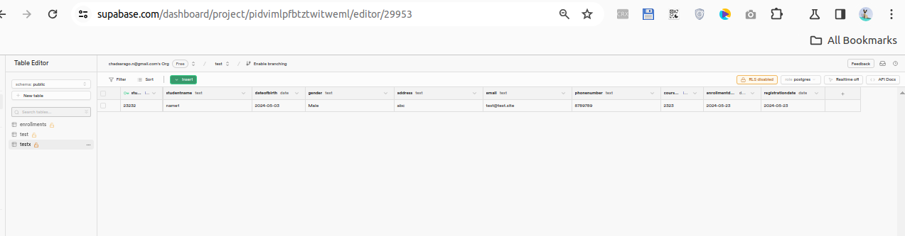

##  Program Initialization


```cs
using Microsoft.AspNetCore.Builder; // Provides classes to create and configure an ASP.NET Core application.
using Microsoft.Extensions.Hosting; // Provides classes for creating and managing the application's lifetime and environment.
using Npgsql; // Provides classes for interacting with PostgreSQL databases.
using System; // Basic system functions and types.
using System.Threading.Tasks; // Provides types that simplify the work of writing asynchronous code.

```
***
##  Build and Configure the Application

```cs
var builder = WebApplication.CreateBuilder(args); // Create and configure a new instance of the WebApplicationBuilder class.
var app = builder.Build(); // Build the WebApplication instance which is used to configure the request pipeline.
```
***
##  Define Database Connection String

```cs
string connectionString = "Host=aws-0-ap-south-1.pooler.supabase.com;Port=5432;Username=postgres.pidvimlpfbtztwitweml;Password=MAY23/postgressql/v1;Database=postgres"; // Define the connection string to connect to the PostgreSQL database.

```
***
##  Define Routes and Handlers

### Route to Display Enrollment Form
```cs
app.MapGet("/", async context =>
{
    var html = @"
        <!DOCTYPE html>
        <html>
        <head>
            <title>Enrollment Form</title>
        </head>
        <body>
            <h1>Add New Enrollment</h1>
            <form action=""/enrollments"" method=""post"">
                <label for=""studentId"">Student ID:</label>
                <input type=""number"" id=""studentId"" name=""StudentId"" required><br><br>
                <label for=""studentName"">Student Name:</label>
                <input type=""text"" id=""studentName"" name=""StudentName"" required><br><br>
                <label for=""dateOfBirth"">Date of Birth:</label>
                <input type=""date"" id=""dateOfBirth"" name=""DateOfBirth"" required><br><br>
                <label for=""gender"">Gender:</label>
                <select id=""gender"" name=""Gender"">
                    <option value=""Male"">Male</option>
                    <option value=""Female"">Female</option>
                    <option value=""Other"">Other</option>
                </select><br><br>
                <label for=""address"">Address:</label>
                <textarea id=""address"" name=""Address"" required></textarea><br><br>
                <label for=""email"">Email:</label>
                <input type=""email"" id=""email"" name=""Email"" required><br><br>
                <label for=""phoneNumber"">Phone Number:</label>
                <input type=""tel"" id=""phoneNumber"" name=""PhoneNumber"" required><br><br>
                <label for=""courseId"">Course ID:</label>
                <input type=""number"" id=""courseId"" name=""CourseId"" required><br><br>
                <label for=""enrollmentDate"">Enrollment Date:</label>
                <input type=""date"" id=""enrollmentDate"" name=""EnrollmentDate"" required><br><br>
                <label for=""registrationDate"">Registration Date:</label>
                <input type=""date"" id=""registrationDate"" name=""RegistrationDate"" required><br><br>
                <button type=""submit"">Submit</button>
            </form>
        </body>
        </html>";
    await context.Response.WriteAsync(html); // Render the HTML form when the root URL is accessed.
});
```
***
### Route to Handle Form Submission

```cs
app.MapPost("/enrollments", async context =>
{
    var form = await context.Request.ReadFormAsync(); // Read form data from the request.

    // Extract individual form fields
    var studentId = form["StudentId"];
    var studentName = form["StudentName"];
    var dateOfBirth = form["DateOfBirth"];
    var gender = form["Gender"];
    var address = form["Address"];
    var email = form["Email"];
    var phoneNumber = form["PhoneNumber"];
    var courseId = form["CourseId"];
    var enrollmentDate = form["EnrollmentDate"];
    var registrationDate = form["RegistrationDate"];

    await using var connection = new NpgsqlConnection(connectionString); // Establish a connection to the PostgreSQL database.
    await connection.OpenAsync(); // Open the database connection.

    var createTableQuery = @"
        CREATE TABLE IF NOT EXISTS testx (
            StudentId INTEGER PRIMARY KEY,
            StudentName TEXT,
            DateOfBirth DATE,
            Gender TEXT,
            Address TEXT,
            Email TEXT,
            PhoneNumber TEXT,
            CourseId INTEGER,
            EnrollmentDate DATE,
            RegistrationDate DATE
        )"; // SQL query to create the table if it does not exist.

    await using (var createTableCmd = new NpgsqlCommand(createTableQuery, connection)) // Create a new NpgsqlCommand to execute the table creation query.
    {
        await createTableCmd.ExecuteNonQueryAsync(); // Execute the table creation query.
    }

    var insertQuery = @"
        INSERT INTO testx (StudentId, StudentName, DateOfBirth, Gender, Address, Email, PhoneNumber, CourseId, EnrollmentDate, RegistrationDate)
        VALUES (@StudentId, @StudentName, @DateOfBirth, @Gender, @Address, @Email, @PhoneNumber, @CourseId, @EnrollmentDate, @RegistrationDate)"; // SQL query to insert form data into the table.

    await using (var cmd = new NpgsqlCommand(insertQuery, connection)) // Create a new NpgsqlCommand to execute the insert query.
    {
        // Add parameters to the SQL query to prevent SQL injection.
        cmd.Parameters.AddWithValue("StudentId", int.Parse(studentId));
        cmd.Parameters.AddWithValue("StudentName", studentName.ToString());
        cmd.Parameters.AddWithValue("DateOfBirth", DateTime.Parse(dateOfBirth));
        cmd.Parameters.AddWithValue("Gender", gender.ToString());
        cmd.Parameters.AddWithValue("Address", address.ToString());
        cmd.Parameters.AddWithValue("Email", email.ToString());
        cmd.Parameters.AddWithValue("PhoneNumber", phoneNumber.ToString());
        cmd.Parameters.AddWithValue("CourseId", int.Parse(courseId));
        cmd.Parameters.AddWithValue("EnrollmentDate", DateTime.Parse(enrollmentDate));
        cmd.Parameters.AddWithValue("RegistrationDate", DateTime.Parse(registrationDate));

        await cmd.ExecuteNonQueryAsync(); // Execute the insert query.
    }

    await context.Response.WriteAsync("Enrollment added successfully!"); // Return a success message to the user.
});
```
***
##  Run the Application
```cs
app.Run(); // Run the application and start listening for incoming HTTP requests.
```
***
##  Setup 

* Ensure you have the .NET SDK installed.
* Create a new ASP.NET Core project using the following command:

```bash
dotnet new web -n Enrollx
cd Enrollx
dotnet add package Npgsql

```

* Replace the Program.cs content with the provided code.
* Run the application using the following command:

```bash
dotnet run

```
* Compile for windows 

```bash
cd path\to\your\project
dotnet publish -c Release -r win-x64 --self-contained

```
***

##  Output

